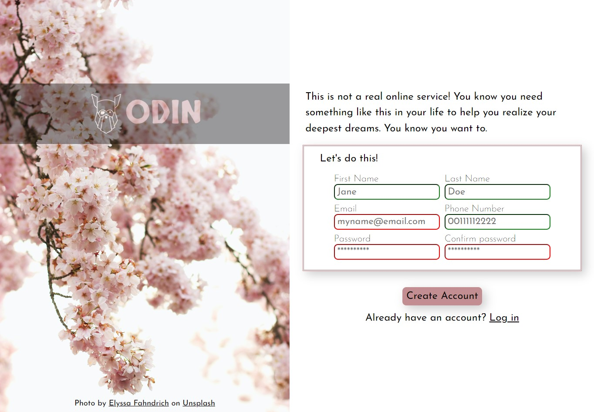

# Sign-Up Form - The Odin Project

Creating a simple sign-up form for the [Intermediate HTML and CSS](https://www.theodinproject.com/lessons/node-path-intermediate-html-and-css-sign-up-form) project from [The Odin Project](https://www.theodinproject.com).

## Table of Contents

- [Overview](#overview)
    - [Screenshot](#screenshot)
    - [Links](#links)
- [My process](#my-process)
    - [Built with](#built-with)
    - [What I learned](#what-i-learned)
    - [Author](#author)

## Overview

### Screenshot

### Links

- Solution URL: [GitHub](https://github.com/amandaquinta/sign-up-form)
- Live Site URL: [Vercel](https://sign-up-form-rho-six.vercel.app/)

## My process

### Built with

- Semantic HTML5 markup
- CSS custom properties
- Flexbox
- CSS Grid

### What I learned

Solidifying basic HTML and CSS usage.

## Author

- Frontend Mentor - [@amandaquinta](https://www.frontendmentor.io/profile/amandaquinta)